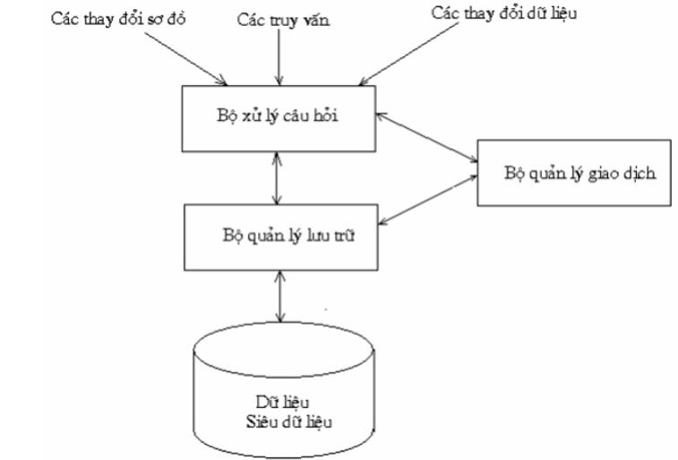

# BUỔI 1: NHẬP MÔN CSDL
## 1.Cơ sở dữ liệu là gì?
#### 1.1 Khái niệm:

- Là một tập hợp các dữ liệu:
    + Biểu diễn một vài khía cạnh nào đó của thế giới thực
    + Có liên hệ logic thống nhất
    + Dược thiết kế và bao gồm những dữ liệu phục vụ mục đích nào đó
- Là một bộ sưu tập các dữ liệu tác nghiệp được lưu trữ lại và được các hệ thống ứng dụng của một xí nghiệp cụ thể nào đó sử dụng 

## 2.Hệ quản trị cơ sở dữ liệu là gì?
#### 2.1 Khái niệm

- **Hệ quản trị cơ sở dữ liệu (Database Management System - DBMS)** là một hệ thống phần mềm giúp quản lý, lưu trữ, truy xuất và chỉnh sửa các dữ liệu một cách có tổ chức và hiệu quả. DBMS là *“cầu nối"* giữa cơ sở dữ liệu và người dùng hoặc các ứng dụng để thực hiện các hoạt động tạo, truy vấn, sửa đổi và xóa dữ liệu.

- Hay hiểu đơn giản, hệ quản trị cơ sở dữ liệu là hệ thống tự động hỗ trợ người dùng kiểm soát các thông tin, tạo dựng, cập nhật và duy trì các cơ sở dữ liệu.

#### 2.2 Cấu trúc



- **Thao tác với DBMS:**
    + Các thao tác chính này gồm các thay đổi sơ đồ, các truy vấn và các thay đổi dữ liệu. Cụ thể các truy vấn sẽ là những yêu cầu về dữ liệu, hỏi đáp trong DBMS. Các thay đổi sơ đồ là việc thay đổi của người dùng quản trị cơ sở dữ liệu như tạo lập cơ sở dữ liệu mới hoặc thay đổi cấu trúc sơ đồ cơ sở dữ liệu. Thay đổi dữ liệu bao gồm việc xóa, cập nhật, sửa đổi dữ liệu trong hệ cơ sở dữ liệu. Các thao tác này sẽ nằm ở phần đỉnh của cấu trúc hệ quản trị cơ sở dữ liệu.

- **Bộ xử lý câu hỏi:**
    + Phần này chịu trách nhiệm xử lý các truy vấn từ người dùng. Các nhiệm vụ thực hiện trong bộ xử lý câu hỏi gồm phân tích các truy vấn, tạo các kế hoạch thực thi và thực thi kế hoạch.

- **Bộ quản lý lưu trữ:**
    + Có trách nhiệm lưu trữ, truy xuất dữ liệu trên các thiết bị lưu trữ như đĩa cứng, bộ nhớ. 

- **Bộ quản lý giao dịch:**
    + Bộ quản lý giao dịch bao gồm cả bộ quản lý lưu trữ và bộ xử lý câu hỏi, thực hiện các nhiệm vụ bảo đảm tính toàn vẹn, tính nhất quán và tính phục hồi của dữ liệu.

- **Dữ liệu và siêu dữ liệu:**
    + Đây là thành phần gồm các dữ liệu, thông tin về dữ liệu như cấu trúc, các ràng buộc và thuộc tính của dữ liệu. Lớp dữ liệu và siêu dữ liệu nằm ở phần đáy của kiến trúc DBMS, là thành phần chính để tạo nên hệ quản trị cơ sở dữ liệu.
#### 2.3 Những đặc điểm của hệ quản trị cơ sở dữ liệu

- **Hệ quản trị cơ sở dữ liệu có một số đặc điểm sau:**

    + **DBMS** có tính bảo mật cao, cung cấp các cơ chế để bảo vệ dữ liệu khỏi bị mất cắp thông tin qua tài khoản và mật khẩu.
    + Hệ quản trị cơ sở dữ liệu có thể sử dụng để lưu trữ, quản lý nhiều loại dữ liệu khác nhau.
    + Cho phép mở rộng để đáp ứng nhu cầu của các ứng dụng có quy mô lớn. 
     + Ứng dụng các kỹ thuật tối ưu hóa nhằm truy xuất dữ liệu, cập nhật thông tin nhanh chóng và hiệu quả.
    + Tập trung dữ liệu vào một nơi duy nhất, ví dụ như máy chủ, giúp người dùng dễ dàng truy cập dữ liệu từ bất kỳ vị trí nào.
    + Có thể chia sẻ và xử lý dữ liệu đa người dùng.
     + Hỗ trợ triển khai trên các nền tảng đa dạng.
     + **DBMS** tuân thủ theo tính chất ACID, gồm *Atomicity (tính nguyên tử), Consistency (tính nhất quán), Isolation (tính độc lập), Durability (tính bền vững)*.
#### 2.4 Phân loại
- **Theo mô hình dữ liệu:**
    + **Hệ quản trị cơ sở dữ liệu quan hệ:** Đây là hệ quản trị cơ sở dữ liệu phổ biến nhất. Các dữ liệu được tổ chức dưới dạng bảng có hàng, cột ràng buộc để lưu trữ và quản lý dữ liệu.
    + **Hệ quản trị cơ sở dữ liệu phi quan hệ:** Các dữ liệu được tổ chức không theo mô hình quan hệ, thường dùng để quản lý, lưu trữ dữ liệu phi cấu trúc như văn bản, video, hình ảnh.
- **Theo cách lưu trữ:**
    + **Lưu trữ trên bộ nhớ:** Lưu trữ dữ liệu trong bộ nhớ RAM để cung cấp tốc độ truy xuất nhanh.
    + **Lưu trữ trên đĩa cứng:** Các dữ liệu được lưu trữ trên đĩa cứng.
- **Theo mức độ phân tán:**
    + **Hệ quản trị cơ sở dữ liệu cục bộ:** Dữ liệu được lưu trữ trên máy tính cục bộ, được sử dụng cho các ứng dụng nhỏ và có quy mô vừa phải.
    + **Hệ quản trị cơ sở dữ liệu phân tán:** Là loại hệ quản trị cơ sở dữ liệu lưu trữ dữ liệu trên nhiều máy tính, được sử dụng cho các ứng dụng có quy mô lớn và có yêu cầu khả năng mở rộng cao.
## 3.Câu lệnh tạo database, table trong MS SQL Server
#### 3.1 Tạo Database
```
CREATE DATABASE TenDatabase;

```
- Trong đó, **TenDatabase** là tên của cơ sở dữ liệu mà bạn muốn tạo.
#### 3.2 Tạo Table
```
USE TenDatabase;

CREATE TABLE TenTable (
    ID INT PRIMARY KEY,
    Ten NVARCHAR(50),
    Tuoi INT,
    DiaChi NVARCHAR(255)
);
```
- **Trong đó:**

    + **TenTable** là tên của bảng bạn muốn tạo.
    + **ID** là một cột kiểu **INT** và được định nghĩa là khóa chính **(PRIMARY KEY)**.
    + **Ten** là một cột kiểu **NVARCHAR** với độ dài tối đa 50 ký tự.
    + **Tuoi** là một cột kiểu **INT**.
    + **DiaChi** là một cột kiểu **NVARCHAR** với độ dài tối đa 255 ký tự.

#### 3.3 Ví dụ
```
CREATE DATABASE MyDatabase;

USE MyDatabase;

CREATE TABLE Employees (
    EmployeeID INT PRIMARY KEY,
    FirstName NVARCHAR(50),
    LastName NVARCHAR(50),
    BirthDate DATE,
    Address NVARCHAR(255)
);
```

- **Trong ví dụ này:**

    + **MyDatabase** là tên của cơ sở dữ liệu.
    + **Employees** là tên của bảng.
    + Các cột của bảng bao gồm **EmployeeID, FirstName, LastName, BirthDate,** và **Address**.
