# BUỔI 2: CƠ BẢN VỀ THIẾT KẾ CƠ SỞ DỮ LIỆU

## 1. Lý thuyết về thiết kế cơ sở dữ liệu
- Thiết kế cơ sở dữ liệu là quá trình chọn lọc, phân nhóm và tổ chức dữ liệu trên hệ thống. Công việc chính là chọn lọc dữ liệu nào sẽ được lưu trữ và quyết định tính tương quan giữa chúng. Nhờ database design, hệ thống sẽ dễ dàng đọc hiểu, quản lý, truy xuất thông tin thông suốt và tiết kiệm chi phí lưu trữ.
- **Mô hình dữ liệu:**
  + Là một hệ thống hình thức toán học gồm:
    + Hệ thống các ký hiệu biểu diễn dữ liệu.
    + Tập hợp các phép toán thao tác trên cơ sở dữ liệu.
  + Đặc trưng của mô hình dữ liệu.
    + Tính ổn định khi thiết kế mô hình dữ liệu.
    + Tính đơn giản, dễ hiểu, dễ thao tác.
    + Tính dư thừa cần phải kiểm tra kỹ lưỡng.
    + Tính đối xứng được bảo toàn.
    + Có cơ sở lý thuyết vững chắc.
- **Các loại mô hình dữ liệu:**
    + ***Mô hình dữ liệu khái niệm:***
        + Là một mô hình trừu tượng và tổng quan về dữ liệu trong một hệ thống thông tin.
        + Tập trung vào việc mô tả các khái niệm, mối quan hệ và luồng thông tin chính trong một hệ thống, đồng thời chi tiết hóa về cách dữ liệu được lưu trữ hoặc triển khai.
    + ***Mô hình dữ liệu logic:***
        + Là một biểu đồ hoặc mô tả trừu tượng về cấu trúc dữ liệu và quan hệ giữa chúng mà không phụ thuộc vào hệ quản trị cơ sở dữ liệu (DBMS) cụ thể.
        + Mô hình này tập trung vào cách dữ liệu được tổ chức, mô tả các thực thể (entities), các thuộc tính (attributes) và mối quan hệ (relationships) giữa các thực thể đó.
  + ***Mô hình dữ liệu vật lý:***
        + Là mô hình tập trung vào các khía cạnh về cấu trúc lưu trữ dữ liệu trong cơ sở dữ liệu.
        + Định nghĩa các đối tượng vật lý như bảng, cột, chỉ mục và quan hệ giữa chúng. Cung cấp chi tiết về cách dữ liệu được lưu trữ trên ổ đĩa hoặc hệ thống lưu trữ.
- **Lợi ích khi có một cơ sở dữ liệu tốt:**
    + Tiết kiệm thời gian và nguồn lực khi cần tra cứu, trích xuất dữ liệu.
    + Hệ thống dễ bảo trì cập nhật.
    + Các bên liên quan có thể hiểu, vận dụng tốt dữ liệu.
- **Nguyên tắc thiết kế cơ sở dữ liệu:**
    + Tránh trùng lặp dữ liệu:
    + Sử dụng các ràng buộc dữ liệu.
    + Thiết kế các bảng có kích thước hợp lý.
    + Sử dụng các khóa chính và khóa ngoại.
    + Thiết kế các bảng có cấu trúc đơn giản.
- **Các bước thiết kế cơ sở dữ liệu:**
    + ***Bước 1: Phân tích yêu cầu:***
        + Cần phải xác định được:
            + Dữ liệu nào được lưu trữ trong CSDL.
            + Ứng dụng nào sẽ được xây dựng trên CSDL này.
            + Các thao tác nào được sử dụng thường xuyên và các yêu cầu về hiệu năng của hệ thống.
        >> Quá trình này liên quan đến những trao đổi của các nhóm
người dùng và nhóm nghiên cứu môi trường hiện tại. Tìm hiểu
các ứng dụng đang có xem có cần thay thế hoặc bổ trợ cho hệ
CSDL không.
    + ***Bước 2: Thiết kế cơ sở dữ liệu mức khái niệm:***
        + Những thông tin có được từ bước phân tích yêu cầu sẽ được dùng để phát triển mô tả mức tổng quát dữ liệu được lưu trong CSDL, cùng các ràng buộc cần thiết trên dữ liệu này.
    + ***Bước 3: Mô hình dữ liệu logic:***
        +   Một hệ quản trị CSDL sẽ được sử dụng để cài đặt CSDL và chuyển thiết kế CSDL mức khái niệm thành một lược đồ CSDL với mô hình dữ liệu của hệ quản trị CSDL đã chọn.
    + ***Bước 4: Cải tiến lược đồ:***
        + Các lược đồ được phát triển ở mức 3 sẽ được phân tích các vấn đề tiềm ẩn.
        + Tại đây, các cơ sở dữ liệu sẽ được chuẩn hóa, dựa trên lý thuyết toán học.
    + ***Bước 5: Thiết kế CSDL mức vật lý:***
        + Khối lượng công việc tiềm ẩn và các phương pháp truy nhập được mô phỏng để xác định các điểm yếu tiềm ẩn trong CSDL mức khái niệm. Quá trình này thường là nguyên nhân tạo ra các tệp chỉ mục hoặc/và các quan hệ nhóm. Trong trường hợp đặc biệt, toàn bộ mô hình khái niệm sẽ được xây dựng lại.
    + ***Bước 6: Thiết kế an toàn báo mật:***
        + Xác định các nhóm người dùng và phân tích vai trò của họ để định nghĩa các phương pháp truy nhập dữ liệu.
    + *Trong quá trình phát triển, thường có bước cuối cùng (bước thứ 7), gọi là ***pha điều chỉnh (tuning phase)***, trong đó CSDL sẽ được thực hiện (mặc dù nó có thể chỉ được chạy mô phỏng) và sẽ được cải tiến, chỉnh sửa để đáp ứng nhu cầu thực thi trong môi trường mong đợi.*
- **Một số khái niệm liên quan:** Hàng, bản ghi, bộ dữ liệu, khóa, phụ thuộc hàm, lược đồ.

## 2. Mô hình thực thể liên kết (Mô hình  E - R, The Entity - Relationship Model)
- Mô hình thực thể liên kết gồm 3 khái niệm cơ bản: tập thực thể, tập quan hệ và thuộc tính.
- **Thực thể** là một đối tượng trong thế giới thực và có thể phân biệt được với các đối tượng khác. Thực thể
có thể cụ thể (một người, một quyển sách, ...) hoặc cũng có thể trừu tượng (một khoản vay ngân hàng, một khái niệm, ...).
-  Thực thể được biểu diễn bởi một tập các **thuộc tính** (là các thuộc tính mô tả hoặc các đặc tính của thực thể).
-  **Tập thực thể** là một nhóm các thực thể có cùng thuộc tính. Ví dụ: tập tất cả khách hàng của ngân hàng có thể được định nghĩa là tập khách hàng.
-  Các tập thực thể không nhất thiết phải tách rời nhau.
   + ***Ví dụ***: có thể định nghĩa tập tất cả những người làm việc ở ngân hàng là nhân viên, tập tất cả những khách hàng của ngân hàng là khách hàng. Một thực thể người nào đó có thể là một nhân viên hoặc một khách hàng hoặc cả hai, hoặc không phải cả hai.

- Mỗi thuộc tính có một tập giá trị cho phép, được gọi là **miền** (hay tập giá trị) của thuộc tính đó.
    + Một thuộc tính của một tập thực thể là một hàm ánh xạ từ một tập thực thể vào một miền giá trị.
    + Một tập thực thể có thể có nhiều thuộc tính.
>> Mỗi thực thể trong tập có thể được mô tả bởi một tập các cặp **<thuộc tính, giá trị>**, ứng với từng thuộc tính trong tập thực thể.

-  Một CSDL bao gồm một tập các thực thể.

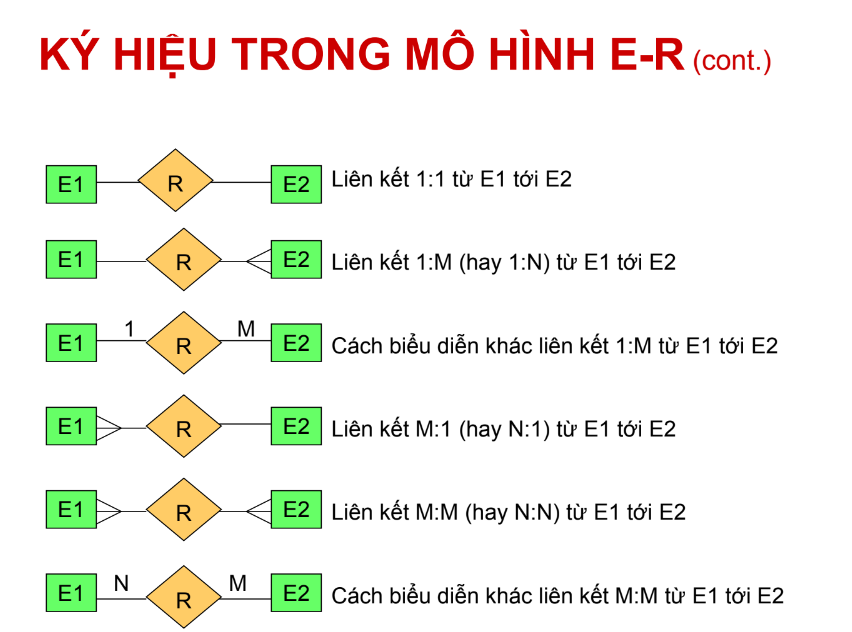

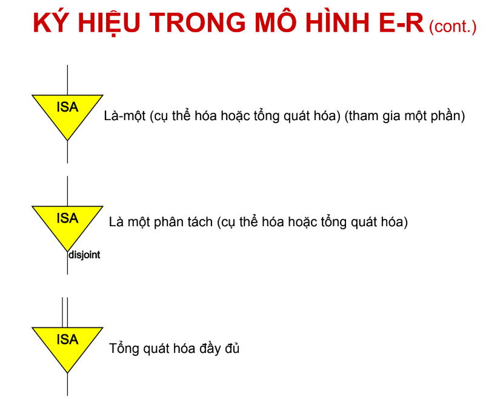

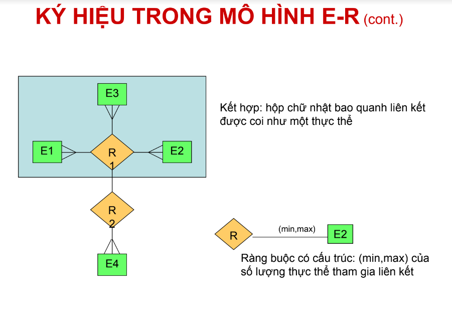

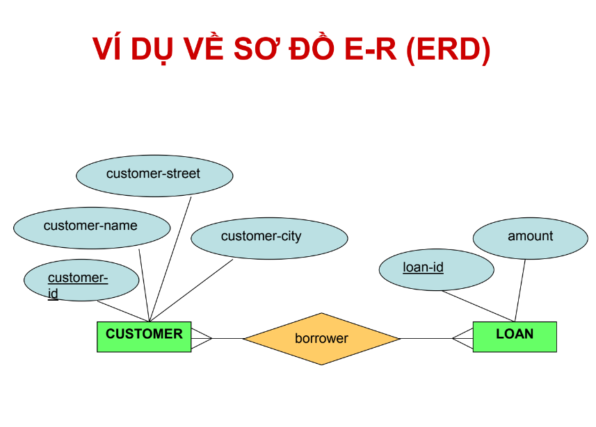

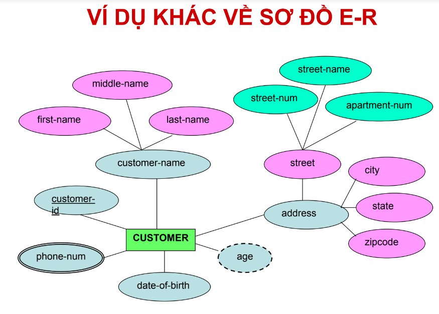

#### 2.1 Các thuộc tính trong mô hình E - R
- **Thuộc tính đơn trị** hoặc **thuộc tính đa trị:** 
     + Thuộc tính đơn trị có nhiều nhất một giá trị tại một thời điểm cụ thể. 
     + Thuộc tính đa trị có thể có nhiều giá trị khác nhau tại một thời điểm.
>> Ví dụ: Tại một trường học sinh viên được đăng ký học theo tín chỉ. Tại một kỳ học nào đó, số tín chỉ một sinh viên đăng ký là đơn trị, ví dụ là 7 (tín chỉ) => số tín chỉ không thể nhận giá trị đa trị. Thuộc tính số điện thoại của sinh viên có thể chứa nhiều giá trị cùng lúc do tại một thời điểm, một sinh viên có thể có một vài số điện thoại khác nhau. => thuộc tính số điện thoại là đa trị.

- **Thuộc tính dẫn xuất:** là thuộc tính mà giá trị của nó được dẫn xuất (hoặc được tính toán) từ những giá trị của các thuộc tính hoặc các thực thể có liên quan.
>>Ví dụ: Giả sử thực thể KHÁCH HÀNG của một ngân hàng có một thuộc tính tên là loans-held, chứa số lượng các khoản vay của một khách hàng tại ngân hàng. Giá trị của thuộc tính này có thể được tính bằng cách đếm số lượng thực thể các khoản vay liên quan tới
khách hàng.
- **Thuộc tính rỗng (Null):** thuộc tính nhận giá trị rỗng khi một thực thể không có giá trị cho nó.

## 3. Mô hình dữ liệu quan hệ (The Ralational Data Model)
- Mô hình dữ liệu quan hệ được phát triển dựa trên khái niệm về quan hệ toán học.
- Nhà khoa học đề xuất ra mô hình quan hệ tên là Codd, là một nhà toán học. Mô hình này liên quan chủ yếu đến lý thuyết tập hợp và logic mệnh đề. 
#### 3.1 Các khái niệm cơ bản
- **Quan hệ:** là một bảng (ma trận) với các hàng và các cột, lưu giữ thông tin về các đối tượng được mô hình hóa trong CSDL.
- **Thuộc tính:** là các cột được đặt tên trong một quan hệ. Mỗi thuộc tính là một đặc tính của một thực thể (hay một quan hệ) được mô hình hóa trong CSDL. Các thuộc tính có thể xuất hiện theo bất kỳ thứ tự nào trong quan hệ.
- **Miền giá trị:** là một tập các giá trị có thể có của một hoặc nhiều thuộc tính. Mỗi thuộc tính được xác định trên một miền giá trị.
- **Bộ:** là một hàng của một quan hệ. Các bộ có thể xuất hiện theo bất kỳ thứ tự nào trong quan hệ.
- **Bậc (cấp):** của một quan hệ là số lượng các thuộc tính mà nó có
- **Lực lượng:** là số lượng các bộ mà một quan hệ có.
- **Cơ sở dữ liệu quan hệ:** là một tập hợp các quan hệ được chuẩn hóa với các tên phân biệt nhau

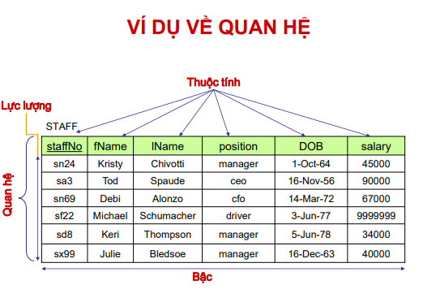

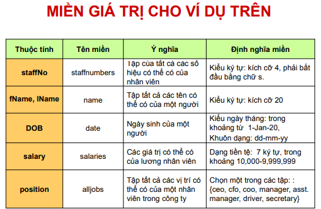

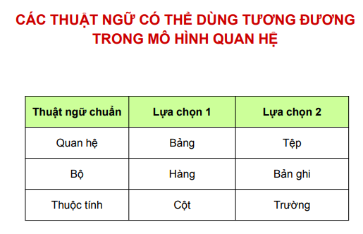

# 4. Chuẩn hóa dữ liệu: 1NF, 2NF, 3NF.

- **Chuẩn hóa dữ liệu** đề cập đến quá trình tổ chức và cấu trúc dữ liệu theo cách loại bỏ sự trùng lặp, đảm bảo tính nhất quán và giảm thiểu các biến đổi dữ liệu. Nó liên quan đến việc chia dữ liệu thành các bảng nhỏ hơn, có quan hệ logic với nhau, giảm thiểu sự lặp lại dữ liệu và thiết lập mối quan hệ giữa các bảng này thông qua các khóa. 
#### 4.1 Dạng chuẩn hóa đầu tiên (1NF)
- Dạng chuẩn hóa đầu tiên yêu cầu mỗi cột trong bảng chỉ chứa các giá trị nguyên tử (không thể phân tách), và không có nhóm dữ liệu lặp lại.  
- Nói cách khác, mỗi thuộc tính của bảng phải chứa một giá trị duy nhất.

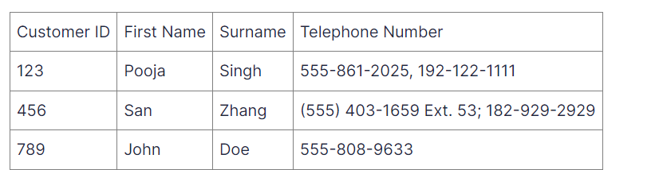 

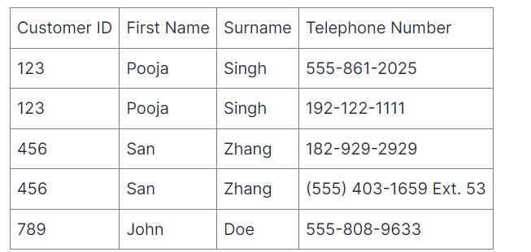
#### 4.2 Dạng chuẩn hóa thứ hai (2NF)
- Dạng chuẩn hóa thứ hai xây dựng trên cơ sở của 1NF bằng cách loại bỏ các phụ thuộc một phần. Phụ thuộc một phần xảy ra khi một thuộc tính phụ thuộc vào chỉ một phần của khóa chính. 
- Để đạt được 2NF, bảng nên được chia thành các bảng riêng biệt, trong đó mỗi thuộc tính phụ thuộc hoàn toàn vào toàn bộ khóa chính.  

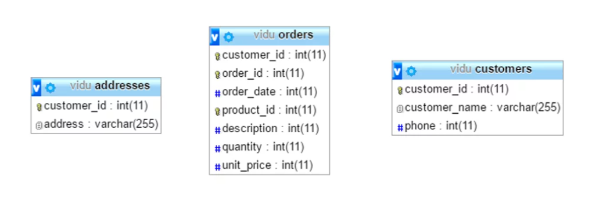

- Bảng dữ liệu trên,  thiết kế vẫn chưa đạt chuẩn 2NF là vì: 
    + một số thuộc tính như description , unit_price phụ thuộc vào 1 phần của khóa là product_id chứ không cần phụ thuộc cả vào tập khóa (customer_id, order_id, product_id), hay thuộc tính customer_name và phone cũng chỉ phụ thuộc vào customer_id, thuộc tính order_date phụ thuộc vào customer_id và order_id, thuộc tính quantity phụ thuộc vào order_id và product_id.

- Vậy nên:
    + Tách các thuộc tính (product_id, description, unit_price) thành một bảng riêng là products.
    + Các thuộc tính (customer_id, order_id, order_date) làm thành một bảng, mình đặt tên là orders.
    + Còn lại các thuộc tính (order_id, product_id, quantity) làm thành một bảng trung gian giữa products và orders, mình đặt là order_products.

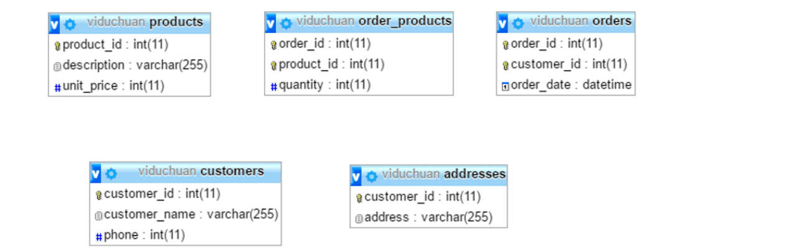
#### 4.3 Dạng chuẩn hóa thứ ba (3NF)
- Dạng chuẩn hóa thứ ba tiếp tục cải thiện cấu trúc bảng bằng cách loại bỏ các phụ thuộc chuyển tiếp. Phụ thuộc chuyển tiếp xảy ra khi một thuộc tính phụ thuộc vào một thuộc tính khác không phải là khóa chính. 

- Trong 3NF, các bảng được chia để loại bỏ các phụ thuộc này. 

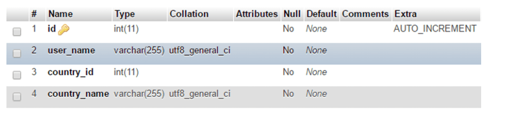

- Thuộc tính country_name phụ thuộc vào country_id, mà country_id lại phụ thuộc vào khóa chính là id. Vì vậy tách bảng trên thành 2 bảng sau:

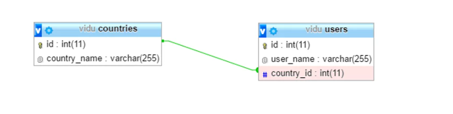