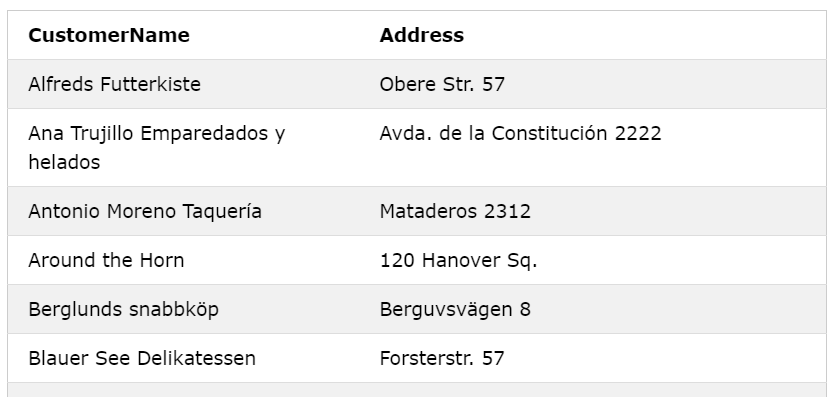
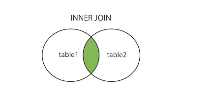
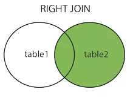
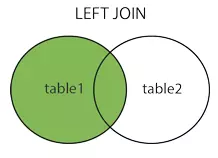
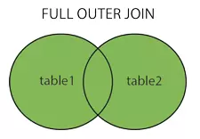

# BUỔI 3: SQL CƠ BẢN

## 1. Query cơ bản
#### 1.1 SELECT
- Câu lệnh **SELECT** được sử dụng để chọn dữ liệu từ cơ sở dữ liệu.
- Cú pháp: 
    ```
    SELECT column1, column2, ...
    FROM table_name;
    ```

  +  Tại đây, column1, column2, ... là tên trường của bảng mà bạn muốn chọn dữ liệu.

  + table_name biểu thị tên của bảng mà bạn muốn chọn dữ liệu từ đó.

- Ví dụ:
    ```
    SELECT CustomerName, Address FROM Customers;
    ```

    + Kết quả: 
    

#### 1.2 JOIN
- **JOIN** là phép kết nối dữ liệu từ nhiều bảng lại với nhau, nối 2 bảng, 3 bảng.. với nhau. Khi bạn cần truy vấn các cột dữ liệu từ nhiều bảng khác nhau để trả về trong cùng một tập kết quả , bạn cần dùng **JOIN**. 2 bảng kết nối được với nhau khi có 1 trường chung giữa 2 bảng này.

##### 1.2.1 INNER JOIN (Hoặc JOIN)
 - **INNER JOIN (Hoặc JOIN)**: Trả về tất cả các hàng khi có ít nhất một giá trị ở cả hai bảng.


- Cú pháp: 
    ```
    SELECT column1, column2, ... FROM table1
    JOIN table2 ON table1.column = table2.column;
    ```

##### 1.2.2 RIGHT JOIN
- **RIGHT JOIN**: Trả lại tất cả các hàng từ bảng bên phải, và các dòng thỏa mãn điều kiện từ bảng bên trái.


- Cú pháp: 
    ```
    SELECT column1, column2, ... FROM table1
    RIGHT JOIN table2 ON table1.column = table2.column;
    ```
##### 1.2.3 LEFT JOIN
- **LEFT JOIN**: Trả lại tất cả các dòng từ bảng bên trái, và các dòng đúng với điều kiện từ bảng bên phải.


- Cú pháp:
    ```
    SELECT column1, column2, ... FROM table1
    LEFT JOIN table2 ON table1.column = table2.column;
    ```
##### 1.2.4 FULL JOIN (Hoặc FULL OUTER JOIN)
- **FULL JOIN**:  Trả về tất cả các dòng đúng với 1 trong các bảng.


- Cú pháp: 
    ```
    SELECT column1, column2, ... FROM table1
    FULL OUTER JOIN table2 ON table1.column = table2.column;
    ```

#### 1.3 GROUP BY
- **GROUP BY** được sử dụng để nhóm các dòng dữ liệu dựa trên giá trị của một hoặc nhiều cột. 
- Mục đích chính của **GROUP BY** là thực hiện các phép tổng hợp hoặc hàm tính toán trên các nhóm dữ liệu.
- Cú pháp:
    ```
    SELECT column_name(s) FROM table_name
    GROUP BY column_name(s);
    ```

- Câu lệnh **GROUP BY** thường được sử dụng với các hàm tổng hợp **(COUNT(), MAX(), MIN(), SUM(), AVG())** để nhóm tập kết quả theo một hoặc nhiều cột.

#### 1.4 ORDER BY
- **ORDER BY**  là một mệnh đề quan trọng giúp sắp xếp kết quả của câu lệnh **SELECT** theo thứ tự mong muốn. 
- Lệnh này được dùng để phân loại dữ liệu theo thứ tự tăng hoặc giảm dần, dựa trên một hoặc nhiều cột. 
- Lệnh **ORDER BY** thường đứng sau lệnh **WHERE, HAVING và GROUP BY.**
- Lệnh **ORDER BY**, có thể dùng từ khóa **ASC (Ascending)** ở cuối để kết quả hiển thị thứ tự tăng dần và **DESC (Descending)** để dữ liệu phân loại theo thứ tự giảm dần.
- Cú pháp cơ bản:
    ```
    SELECT column_name(s) FROM table_name
    ORDER BY column1, column2,... [ASC/DESC];
    ```

#### 1.5 HAVING, WHERE
##### 1.5.1 HAVING
- **HAVING** là một điều kiện được sử dụng trong SQL sau mệnh đề **GROUP BY.**
-  Nó được sử dụng để lọc các nhóm dữ liệu dựa trên hàm tính toán (aggregate function). Mục đích chính của **HAVING** là lọc các nhóm dữ liệu sau khi đã thực hiện tính toán.
-  Cú pháp cơ bản:
    ```
    SELECT column_name(s) FROM table_name
    GROUP BY column_name(s)
    HAVING condition
    ```

- Ví dụ:
    ```
    SELECT COUNT(CustomerID), Country FROM Customers
    GROUP BY Country
    HAVING COUNT(CustomerID) > 5;
    ```

##### 1.5.2 WHERE
- **WHERE** được sử dụng để lọc bản ghi.
- Được sử dụng để chỉ trích xuất những bản ghi đáp ứng một điều kiện cụ thể.
- Cú pháp cơ bản:
    ```
    SELECT column1, column2, ... FROM table_name
    WHERE condition;
    ```
- Ví dụ:
    ```
    SELECT * FROM Customers
    WHERE Country='Mexico';
    ```

- *Lưu ý: Mệnh đề này WHERE không chỉ được sử dụng trong SELECTcác câu lệnh mà còn được sử dụng trong UPDATE, DELETE, v.v.!*

##### 1.5.3 HAVING và WHERE khác nhau ở đâu?

- **WHERE** sử dụng để lọc các hàng của dữ liệu gốc trong khi **HAVING** sử dụng để lọc các hàng của kết quả sau **GROUP BY**.

- Các hàm tính toán (Aggregate Functions) ví dụ: SUM, AVG, MIN, MAX, … chỉ có thể được sử dụng trong câu lệnh HAVING, không được sử dụng trong WHERE.

## 2. SubQuery
- **Subquery (Truy vấn con)** trong SQL là một truy vấn được lồng trong một truy vấn khác. Subquery có thể được sử dụng trong các lệnh **SELECT, INSERT, UPDATE hoặc DELETE** hoặc bên trong một lệnh khác để thực hiện các thao tác dữ liệu phức tạp hơn.

- Ví dụ:
    + Sử dụng SubQuery trong SELECT
    ```
    SELECT product_name, (SELECT AVG(price) FROM products) AS average_price FROM products;

    => Ở đây, subquery tính toán giá trị trung bình của cột price từ bảng products.
    ```

    + Sử dụng SubQuery trong WHERE
    ```
    SELECT product_name FROM products
    WHERE price > (SELECT AVG(price) FROM products);

    => SubQuery trả về giá trị trung bình của price, và truy vấn chính chỉ chọn các sản phẩm có giá cao hơn giá trị trung bình đó.
    ```
    + Sử dụng SubQuery trong FROM
    ```
    SELECT subquery_table.product_name, subquery_table.total_sales FROM (SELECT product_name, SUM(sales) AS total_sales FROM sales GROUP BY product_name) AS subquery_table;

    => SubQuery trong mệnh đề FROM tạo ra một bảng tạm thời subquery_table chứa tổng số lượng bán hàng cho mỗi sản phẩm.
    ```
    + Sử dụng SubQuery trong HAVING
    ```
    SELECT department, SUM(salary) AS total_salary FROM employees
    GROUP BY department
    HAVING SUM(salary) > (SELECT AVG(total_salary) FROM (SELECT SUM(salary) AS total_salary FROM employees GROUP BY department) AS dept_total_salaries);

    => Subquery bên trong mệnh đề HAVING giúp lọc ra những phòng ban có tổng lương lớn hơn mức trung bình của tổng lương các phòng ban khác.
    ```

- Lợi ích:
    + Giúp truy vấn SQL ngắn gọn và dễ hiểu hơn.
    + Dễ dàng tái sử dụng các phần của truy vấn.
    + Giúp thực hiện các phép tính phức tạp trong một bước duy nhất.

- Hạn chế: 
    + Có thể gây giảm hiệu suất nếu không tối ưu.
    + Khó theo dõi và gỡ lỗi trong các truy vấn phức tạp.